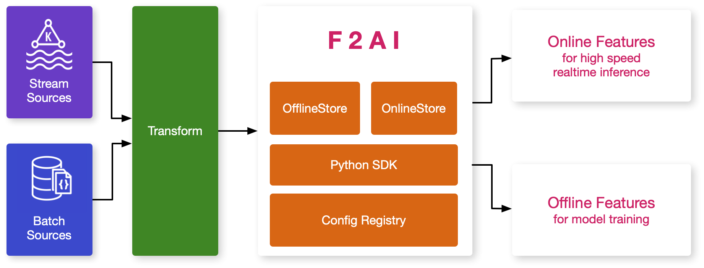

F2AI
====

The architecture above is a working flow demonstration when using F2AI but not technical architecture.

Getting Started
---------------

1. Install F2AI

=======
.. image:: https://readthedocs.org/projects/f2ai/badge/?version=latest
    :target: https://f2ai.readthedocs.io/en/latest/?badge=latest
    :alt: Documentation Status

Overview
-------------

F2AI (Feature Store to AI) is a time centric productivity data utils that re-uses existing infrastructure to get features more consistently though different stages of AI development.

F2AI is focusing on:

* **Consistent API to get features for training and serving**: Powered by well encapsulated OfflineStore and OnlineStore, the features are strictly managed by F2AI, and keep the same structure not only when training models, but also inference.
* **Prevent feature leakage** by effective point-in-time join that reduce the cumbersome works to get features ready when experimenting a feature combinations or AI model.
* **Build-in supported period feature** that allows 2 dimensional features can be retrieved easily. This is useful when facing some deep learning tasks like, time series forecasting.
* **Infrastructure unawareness** by different infrastructure implementations, switching between different data storage is simply changing the configuration. The AI model will works well like before.

Architecture
------------

.. note::
   This is a  working flow when using F2AI instead of technical architecture.
